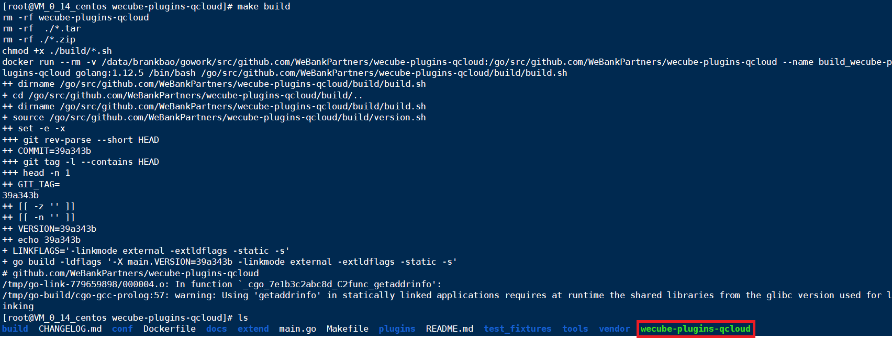
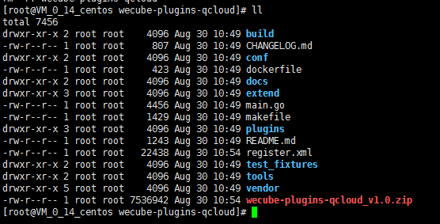

# WeCube Plugins QCLOUD Compile Guide

## Before compilation
1. one Linux host, resource configuration is recommended 4 cores 8GB or more for speed up the compilation.
2. The operating system version is recommended to be ubuntu16.04 or higher or centos7.3 or higher.
3. The network needs to be able to access internet (need to download and install the software from internet).
4. install Git
	- yum install
	```
 	yum install -y git
 	```
	- PLease refer to [git install guide](https://github.com/WeBankPartners/we-cmdb/blob/master/cmdb-wiki/docs/install/git_install_guide_en.md) on how to install manually.

5. install docker1.17.03.x or higher
	- PLease refer to [docker install guide](https://github.com/WeBankPartners/we-cmdb/blob/master/cmdb-wiki/docs/install/docker_install_guide_en.md) on how to install docker.


## Compiling and Packaging
1. pull source code from github
	
	Switch to the local repository directory and execute the command as following
	
	```
	cd /data
	git clone https://github.com/WeBankPartners/wecube-plugins-qcloud.git
	```

	Enter the github account username and password as prompted, and you can pull the source code to the local.

    After that, enter the wecube-plugins-qcloud directory and the structure is as follows:

	

2. Compile and package the plugin

	Build plugin binary
	
	```
	make build
	```
	
	


	Build plugin docker image, the docker image tag is github's commit number
	```
	make image
	```

	

	
	If you want to build a plugin package to work with WeCube, please execute the following command. You can replace variable {$package_version} with the version number you want.

	```
	make package PLUGIN_VERSION=v1.0
	```

	as follows:

	